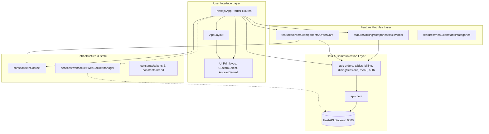
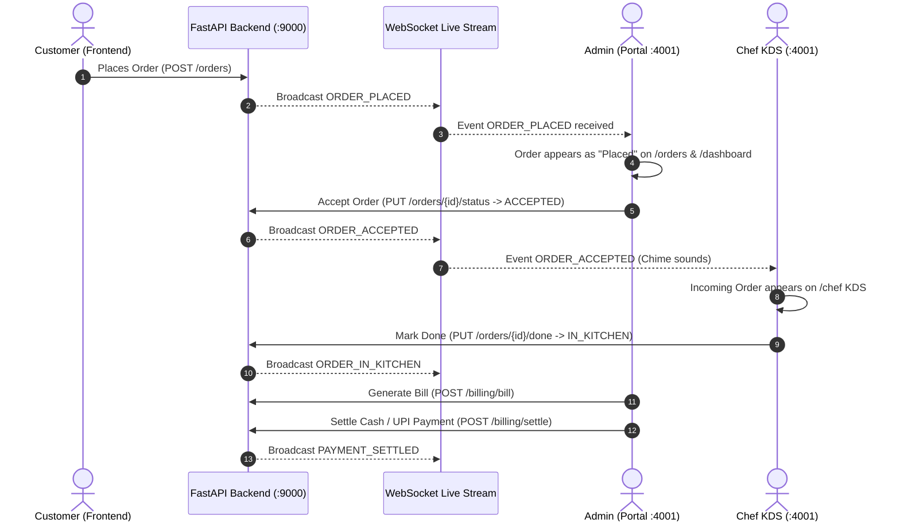

# Vaan Vibes Management Portal — Feature-to-File Map

## 1. Feature Map & Source Code Matrix

| Feature | Access Route | Primary Page Component | Feature Components | Reusable UI / Layout | API Services |
|---|---|---|---|---|---|
| **Authentication** | `/login` | `src/app/login/page.tsx` | N/A | `AuthContext` | `authApi` |
| **Admin Dashboard** | `/dashboard` | `src/app/dashboard/page.tsx` | `OrderCard`, `BillModal` | `AppLayout`, `CustomSelect` | `ordersApi`, `tablesApi` |
| **Orders Operations** | `/orders` | `src/app/orders/page.tsx` | `OrderCard`, `BillModal` | `AppLayout` | `ordersApi` |
| **Dining Billing / POS** | `/billing` | `src/app/billing/page.tsx` | `BillModal` | `AppLayout` | `diningSessionsApi`, `billingApi` |
| **Table Management** | `/tables` | `src/app/tables/page.tsx` | N/A | `AppLayout`, `CustomSelect` | `tablesApi` |
| **Menu Catalog** | `/menu-items` | `src/app/menu-items/page.tsx`| `categories.ts` | `AppLayout`, `CustomSelect` | `menuApi` |
| **Chef KDS** | `/chef` | `src/app/chef/page.tsx` | `OrderCard` | `AppLayout` | `ordersApi` |
| **Staff Management** | `/chefs` | `src/app/chefs/page.tsx` | N/A | `AppLayout`, `CustomSelect` | `authApi` |
| **Staff Profile** | `/profile` | `src/app/profile/page.tsx` | N/A | `AppLayout` | `authApi` |
| **Cafe Settings** | `/settings` | `src/app/settings/page.tsx` | N/A | `AppLayout`, `CustomSelect` | `CAFE_BRAND` |

---

## 2. Module Dependency Architecture

---

## 3. Real-Time Order & Kitchen Lifecycle Flow

